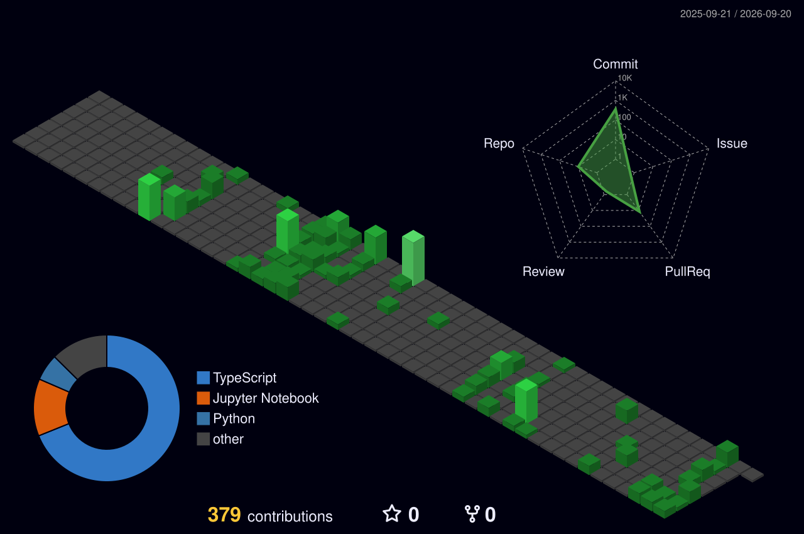

 

---

## ⚡ About Me

I'm **Abdelbari Kecita**, a Computer Science student at **Qatar University** 🇶🇦, passionate about building full-stack web apps and AI/ML solutions that solve real problems. I love shipping products — from idea to cloud-deployed reality.

- 🌱 Learning **Mobile/Web App Development** & **Advanced ML Architectures**
- 💬 Ask me about **React**, **Python**, **AI/ML integration**, or **Cloud deployment**
- 📫 Reach me: **abdelbari.m.kecita@gmail.com**

---

## 🛠️ Tech Stack

### 🌐 Frontend

### 🤖 AI/ML & Backend

### ☁️ Cloud & DevOps

### 🗄️ Tools & Design

---

## 📊 GitHub Stats

&nbsp;&nbsp;

---

## 📈 Contribution Activity

---

## 🌐 Connect With Me

---

*"Code is not just logic — it's craft."* 💻

